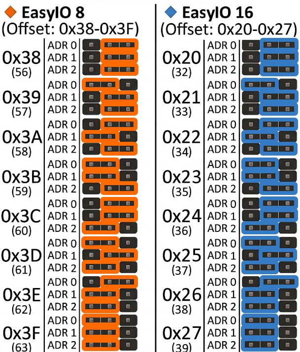

\# EasyIO Library

Arduino library for controlling \*\*PCF8574A\*\* (8-bit) and \*\*PCF8575\*\* (16-bit) I2C I/O expander modules.

\## Features

\- Active-LOW output logic handling (for relays)

\- automatic input mask preservation (0xF0 for 8-bit, 0xFF00 for 16-bit)

\- Single bit writing and reading

\- Binary bulk writing and reading

\## Installation

1\. Download this repository as a `.ZIP` file.

2\. Open Arduino IDE -> \*\*Sketch\*\* -> \*\*Include Library\*\* -> \*\*Add .ZIP Library...\*\*

\## Quick Start

Interrupt_Jumper.png

\## Interrupt function
Every shield provides an interrupt function driven by the open-drain INT pin of the PCF8574A / PCF8575.All INT pins across the shields are connected in parallel to a single line, which can be routed directly to a microcontroller interrupt input.
When an input or output state changes, the INT pin triggers a LOW signal for a minimum duration of 1 microsecond.
The interrupt remains active until a read or write operation is performed on the I2C bus.

